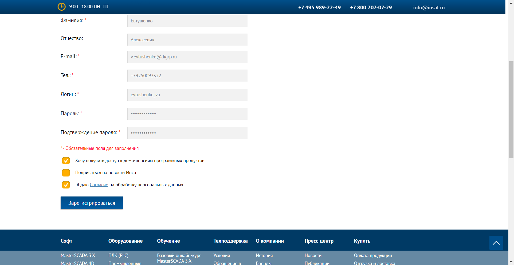
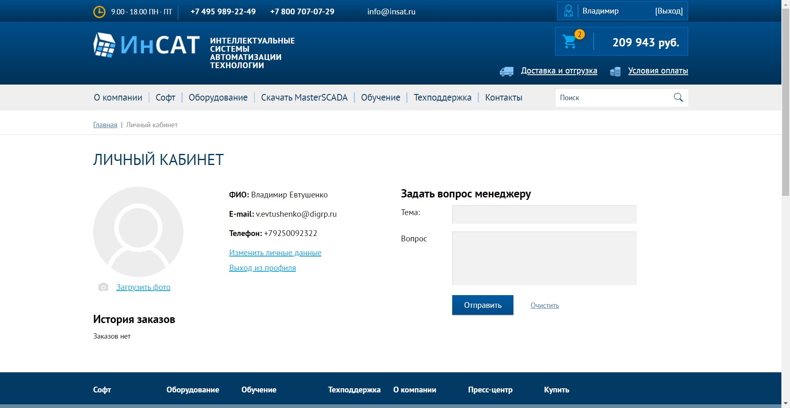
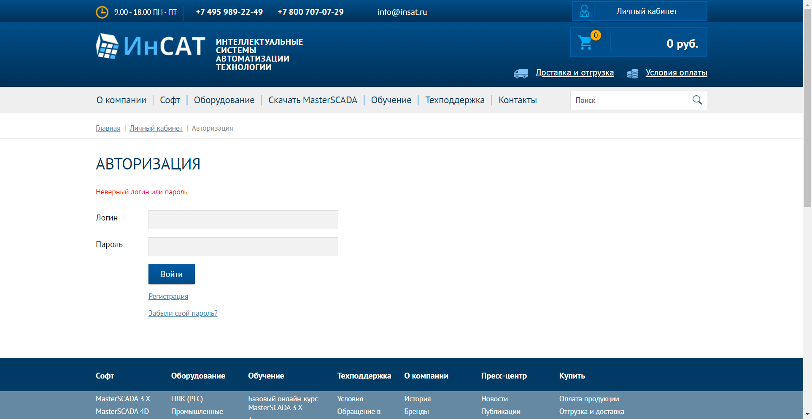
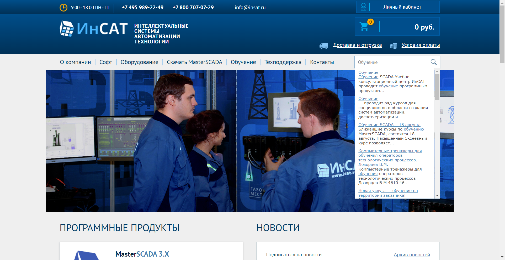
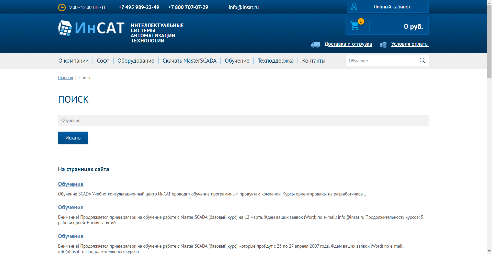
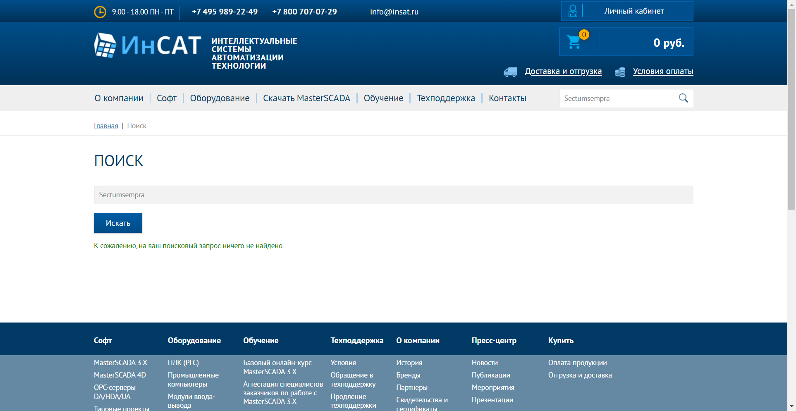

# Проект по автоматизации тестрования сайта компании ИнСАТ

## Навигация

<a href="#Реализованные-проверки">Реализованные проверки</a>

<a href="#Запуск-тестов-из-терминала">Запуск тестов из терминала</a>

<a href="#Параметры-тестов">Параметры тестов</a>

<a href="#Сборка-в-Jenkins">Сборка в Jenkins</a>

<a href="#Отчет-Allure-Report">Отчет Allure Report</a>

<a href="#Уведомления-в-Telegram">Уведомления в Telegram</a>

<a href="#Видеозапись-прохождения-теста">Видеозапись прохождения теста</a>

<a href="#Применявшийся-стек">Применявшийся стек</a>

## Реализованные проверки

* <a href="#Проверка работы формы регистрации">Проверка заполнения и отправки формы регистрации нового пользователя</a>
* * 
* <a href="#Проверки авторизации">Проверка авторизации</a>
* * Тест успешной авторизации
* * 
* * Тест неуспешной авторизации
* * 
* <a href="#Проверка поиска">Проверка работы автодополнения строки поиска и поиска по сайту</a>
* * Тест автодополнения поиска
* * 
* * Тест успешного поиска
* * 
* * Тест безуспешного поиска
* * 

<a href="#Навигация">Назад к оглавлению</a>

## Параметры тестов
Для изменения настроек запуска тестов отредактируйте файл
``
remote.properties
``
в папке
``
src/test/resources/config
``
Для настройки среды выполнения

* browser (Браузер, по умолчанию chrome)
* browserVersion (Версия браузера, по умолчанию 106.0)
* browserSize (Размер окна браузера, по умолчанию 1920x1080)
* remoteDriverUrl (URL и логин/пароль хоста, на котором вы запускаете тесты)
* videoStorage (URL с которого вы получаете видеозапись теста)

Для настройки тестовых данных:

* userPassword (Пароль пользователя сайта, если оставить поле пустым будет сгенерирован случайным образом)
* userName (Логин пользователя сайта, если оставить поле пустым будет сгенерирован случайным образом)
* firstName (Имя пользователя сайта, если оставить поле пустым будет сгенерировано случайным образом)
* secondName (Отчество пользователя сайта, необязательное поле)
* lastName (Фамилия пользователя сайта, если оставить поле пустым будет сгенерирована случайным образом)
* testEmail (Электронная почта пользователя сайта, если оставить поле пустым будет сгенерирована случайным образом)
* testPhone (Телефон пользователя сайта, если оставить поле пустым будет сгенерирован случайным образом)
* searchText (Текст для проверки поиска, значение по умолчанию "Обучение")

Также для изменения параметров тестов вы можете запустить их из консоли с соответствующими ключами, по аналогии с примерами ниже

```bash
.gradlew clean testSiteSections -Dbrowser="{Название браузера}" -DbrowserVersion="{Версия браузера}" -DbrowserSize="{}" -DremoteDriverUrl="{https://Имя пользователя:Пароль@Адрес хоста, на котором проводится запуск тестов}"
```
Например такая команда запустит тесты в браузере Опера, версии 87.0
```bash
.gradlew clean testSiteSections -Dbrowser="opera" -DbrowserVersion="87.0"
```


## Запуск тестов из терминала
#### Запуск всех тестов
```bash
gradle clean tests
```
#### Запуск теста регистрации
```bash
gradle clean registrationTest
```
#### Запуск тестов авторизации
```bash
gradle clean authorisationTest
```
#### Запуск теста успешного поиска
```bash
gradle clean searchTest
```
#### Запуск теста безуспешного поиска
```bash
gradle clean searchFailedTest
```
<a href="#Навигация">Назад к оглавлению</a>

## Отчет-Allure-Report:
Для получения отчёта с помощью команды в консоли введите
```bash
allure serve build/allure-results
```

<a target="_blank" href="https://jenkins.autotests.cloud/job/">Здесь вы можете увидеть отчёт Allure report последней сборки в Jenkins</a>

<a href="#Навигация">Назад к оглавлению</a>

## Сборка в Jenkins
<a target="_blank" href="https://jenkins.autotests.cloud/job/">Здесь вы можете попробовать запустить тесты самостоятельно</a>

<a href="#Навигация">Назад к оглавлению</a>

##Уведомления в Telegram
Вы можете получать уведомления о статусе тестов в Telegram.
Для получения уведомления <a target="_blank" href="https://t.me/">вступите в эту группу</a>

Уведомления будут приходить после каждого запуска <a target="_blank" href="https://jenkins.autotests.cloud/job/">этой сборки в Jenkins </a>

Чтобы узнать больше о настройке уведомлений, <a target="_blank" href="https://github.com/qa-guru/allure-notifications">пожалуйста, посетите страницу разработчика</a>

<a href="#Навигация">Назад к оглавлению</a>

## Видеозапись прохождения теста
<p></p>

<a href="#Навигация">Назад к оглавлению</a>

## Применявшийся стек
<p align="center">


</p>

<a href="#Навигация">Назад к оглавлению</a>

:heart: <a target="_blank" href="https://qa.guru">qa.guru</a><br/>
:blue_heart: <a target="_blank" href="https://t.me/qa_automation">t.me/qa_automation</a>
